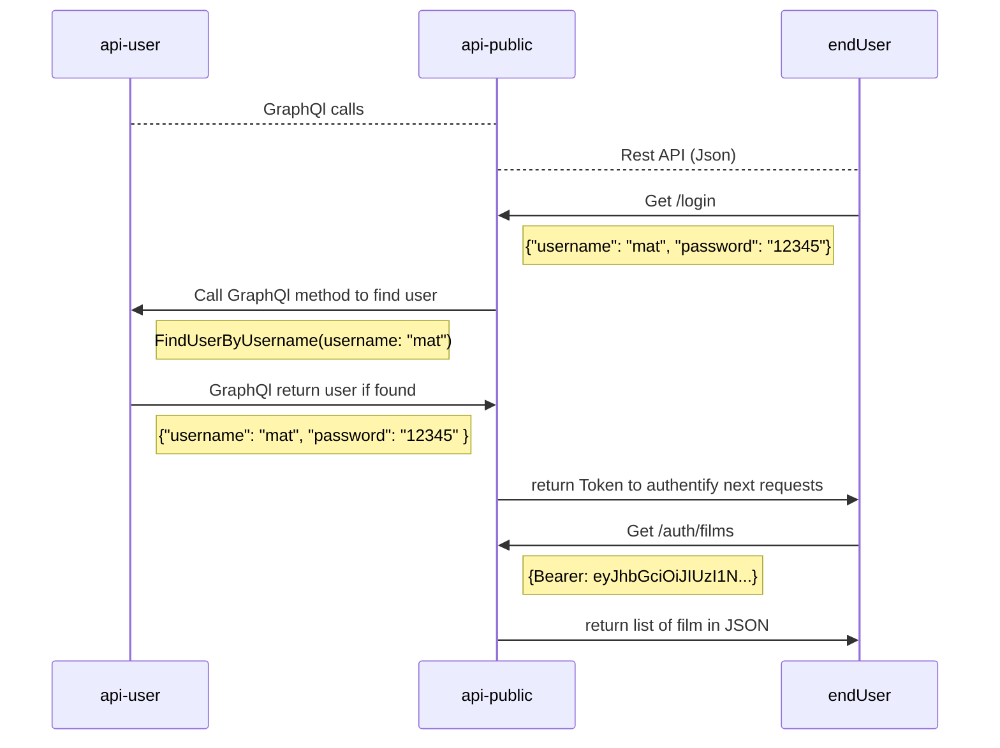

# omdb-test
test api omdb

### REQUIRED
You need a least 

####  GOOGLE Crédentials
    SET GSHEET_API_KEY_PATH var on the .env doc and give path to your .json key file 
    GSHEET_SPREADSHEET_ID an ID of a Google Sheet doc

#### OMDB API Crédential
    SET OMDB_API_KEY on the .env file 

### Install
You can use

    $ nvm use
to set the correct NPM version

### [Makefile](Makefile)
This package contain a Makefile in to start easier the project
install dépendency:

    $ make 
or

    $ make install
Starting the project: 

    $ make start

This app use Express Js ands respond to this endpoints:

* [/films](http://localhost:5400/films)
to get the JSON of all film base on the search promt `Fast & Furious`

* [export](http://localhost:5400/export)
To export a list of film in Gsheet base on the search prompt `Pirates des caraïbes`

* [/auth/films](http://localhost:5400/auth/films)
  secure route idem to /films needs a Bearer Token

* [/auth/export](http://localhost:5400/auth/export)
  secure route idem to /export needs a Bearer Token

* [/search](http://localhost:5400/search)
  universsal search route param

    {
     "search": "donald", 
     "format": "gsheet|json" 
    }

* [/login](http://localhost:5400/login)
  login route to authenticate

you can log in with: 

      username: 'mat',
      password: '12345',
 
      username: 'PaulAuster',
      password: '12345',
  
      username: 'john_doe',
      password: 'jojom',

## How it's build :

This code is based on Github Monorepo see: [MonoRepo explainations for more détails](https://www.atlassian.com/git/tutorials/monorepos)
We choose Typescript way to implément the test. 
It contains 2 logical app: 
#### api-user:
A GraphQl api based on Appolo server serving users and simulating a database

#### api-public:
A rest Api based on ExpressJs, with few endpoints.
it deserving 3 kind type of endpoints:
- 2 endpoints as asking in the test /
- The same endpoints but secured /auth/*
- a secure route for login
- and a last endpoint more generic tu do the same work.

## How Running the project:
See Makefile section [Makefile](#Makefile)

## How to deploy the project:

We have built the project with the goal of deploy on AWS Lambda

We just have to create a zip file of the Lib folder to export on aws Lambda

## How to check the Lauching:

AWS Lambda must be set behind a CloudFront proxy, and could be déploy in multiple AWS région 

## Next Steps (strengths, weakness) : 
GraphQl api should be secured
verify all api callback and enforce errors 
add applicative logs, and cleanup Type
Connect Users to a BDD
Improve the Gsheet code and errors
the code is cheap and easy to understand, cost in infra sould be unsignificant

## How authentification  Work:

